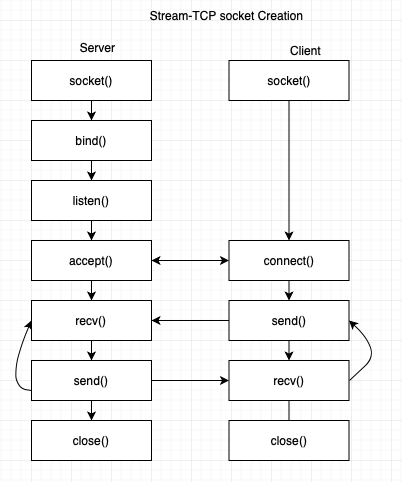
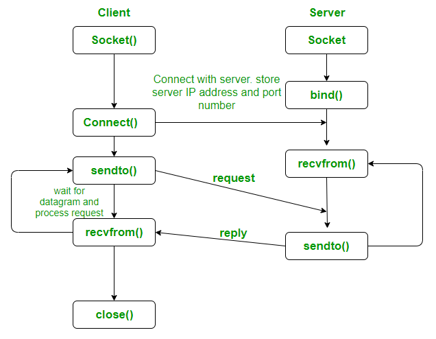
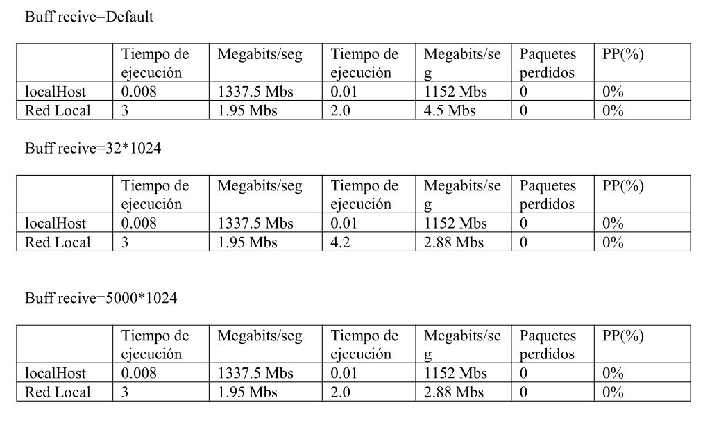

# Network Communication with Sockets  in C

This is an example of socket programming in C language on a Linux System. Sockets are the "virtual" endpoints of any kind of network communications done between 2 hosts over in a network.

In this example, a comparative analysis is made between data transmission by two different protocols: TCP and UDP.

## TCP

## UDP

#### Analysis

We can see according to the theory that UDP is on average faster compared to TCP protocol. However, this comes with the trade-off that during UDP transmission more packets are lost than in TCP, since the UDP protocol is simpler, transmission is faster at the cost of packet loss.

#### Conclusion
The best option depends on the purpose, if we want it fast without worrying about losing some packets then UDP seems fine. But if what you want is to have the security of delivering all the complete packets, the best option is TCP.